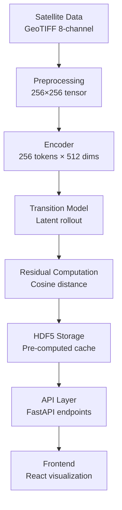
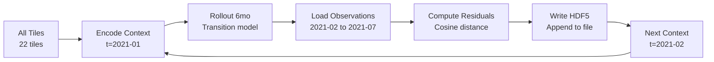

# SIAD Data Flow Architecture

**Purpose:** Complete data transformation pipeline from satellite imagery to UI visualization
**Owner:** Agent 1 (Architecture)
**Status:** ✅ Complete
**Last Updated:** 2026-03-03

---

## Overview

SIAD processes satellite imagery through multiple transformation stages:

```
GeoTIFF → Tensor → Latents → Predictions → Residuals → HDF5 → API → UI
```

This document details each transformation stage, data formats, and processing pipelines.

---

## Pipeline Architecture

### High-Level Flow



---

## Stage 1: Data Acquisition

### Input: Satellite Imagery

**Sources:**
- Sentinel-1 SAR (C-band radar): VV, VH polarizations
- Sentinel-2 Optical: RGB + NIR bands
- VIIRS Nightlights: DNB band

**Format:** GeoTIFF, 1 file per modality per month
**Resolution:** 256m per pixel (resampled to common grid)
**Tile Size:** 256×256 pixels (~65km × 65km at equator)

**File Structure:**
```
data/tiles/
├── tile_x000_y000/
│   ├── 2021-01_s1.tif      # Sentinel-1 (2 channels)
│   ├── 2021-01_s2.tif      # Sentinel-2 (4 channels)
│   ├── 2021-01_viirs.tif   # VIIRS (1 channel)
│   ├── 2021-02_s1.tif
│   └── ...
```

### Preprocessing

**Operation:** Stack 8 channels into single tensor

**Code:**
```python
import rasterio
import numpy as np

def load_tile(tile_id: str, month: str) -> np.ndarray:
    """Load 8-channel observation for a tile-month

    Returns:
        np.ndarray: shape (8, 256, 256), dtype float32
    """
    tile_dir = f'data/tiles/{tile_id}'

    # Load each modality
    s1 = rasterio.open(f'{tile_dir}/{month}_s1.tif').read()  # (2, 256, 256)
    s2 = rasterio.open(f'{tile_dir}/{month}_s2.tif').read()  # (4, 256, 256)
    viirs = rasterio.open(f'{tile_dir}/{month}_viirs.tif').read()  # (1, 256, 256)

    # Stack channels: [S1_VV, S1_VH, S2_R, S2_G, S2_B, S2_NIR, VIIRS, PAD]
    obs = np.concatenate([s1, s2, viirs, np.zeros((1, 256, 256))], axis=0)

    return obs.astype(np.float32)
```

**Output:** `(8, 256, 256)` tensor

---

## Stage 2: Encoding

### Encoder: CNN → Transformer

**Architecture:**
```
Input: (8, 256, 256)
  ↓
CNN Stem (3 conv layers)
  ↓
Spatial Tokenization (16×16 grid)
  ↓
Token Transformer (6 blocks)
  ↓
Output: (256, 512) latent tokens
```

**Transformation:**
- Input: 8 channels × 256×256 pixels = 524,288 values
- Output: 256 tokens × 512 dims = 131,072 values (~4x compression)

**Code:**
```python
from siad.models import load_encoder

encoder = load_encoder('checkpoints/encoder_best.pt')

obs = load_tile('tile_x000_y000', '2024-01')  # (8, 256, 256)
obs_tensor = torch.from_numpy(obs).unsqueeze(0)  # (1, 8, 256, 256)

with torch.no_grad():
    z = encoder(obs_tensor)  # (1, 256, 512)
```

**Latent Space Properties:**
- 256 tokens arranged in 16×16 spatial grid
- Each token encodes 16×16 pixel region
- 512-dimensional embedding per token
- Normalized (L2 norm ≈ 1 per token)

---

## Stage 3: Transition (Prediction)

### Transition Model: FiLM-Conditioned Transformer

**Architecture:**
```
Input: z_context (256, 512), actions (H, 2)
  ↓
FiLM Conditioning (rain, temp)
  ↓
Transformer Rollout (6 blocks)
  ↓
Output: z_pred (H, 256, 512)
```

**Action Conditioning:**
- Rain anomaly: -3σ to +3σ (standardized)
- Temperature anomaly: -2°C to +2°C

**Code:**
```python
from siad.models import load_transition_model

transition = load_transition_model('checkpoints/transition_best.pt')

# Context observation (encoded)
z_context = encoder(obs_2024_01)  # (1, 256, 512)

# Actions for 6 future months
actions = torch.tensor([
    [0.0, 0.0],  # Feb: neutral weather
    [0.0, 0.0],  # Mar: neutral
    [0.0, 0.0],  # Apr: neutral
    [0.0, 0.0],  # May: neutral
    [0.0, 0.0],  # Jun: neutral
    [0.0, 0.0],  # Jul: neutral
])  # (6, 2)

# Rollout predictions
with torch.no_grad():
    z_pred = transition.rollout(z_context, actions)  # (6, 256, 512)
```

**Prediction Horizon:** 1-12 months (6 months typical for demo)

---

## Stage 4: Residual Computation

### Cosine Distance in Latent Space

**Formula:**
```
residual[i] = 1 - cosine_similarity(z_pred[i], z_obs[i])

where:
  cosine_similarity(a, b) = (a · b) / (||a|| × ||b||)
```

**Token-Level Residuals:**
```python
from siad.detect.residuals import compute_residuals

# Load actual observations for future months
z_obs_feb = encoder(load_tile('tile_x000_y000', '2024-02'))
z_obs_mar = encoder(load_tile('tile_x000_y000', '2024-03'))
# ... (load all 6 months)

z_obs = torch.stack([z_obs_feb, z_obs_mar, ...])  # (6, 256, 512)

# Compute residuals
result = compute_residuals(
    z_pred=z_pred,  # (6, 256, 512)
    z_obs=z_obs,    # (6, 256, 512)
    tile_id='tile_x000_y000',
    months=['2024-02', '2024-03', '2024-04', '2024-05', '2024-06', '2024-07']
)

# result.residuals: (6, 256) - one residual per token per month
# result.tile_scores: (6,) - 90th percentile per month
```

**Tile-Level Aggregation:**
```python
tile_score[t] = np.percentile(residuals[t], 90)
```

**Rationale:** Focus on top 10% of tokens (hotspots), ignore noisy baseline.

---

## Stage 5: HDF5 Storage

### Pre-Computation Pipeline

**Purpose:** Avoid recomputing residuals on every API request

**Workflow:**


**Script:** `scripts/precompute_residuals.py`

**Process:**
1. For each tile (22 tiles):
   2. For each context month (2021-01 to 2023-07, sliding window):
      3. Encode context observation
      4. Rollout predictions for next 6 months
      5. Load and encode actual observations
      6. Compute token-level residuals
      7. Compute baselines (persistence, seasonal)
      8. Write to HDF5

**Output:** `data/residuals/residuals.h5` (< 1 MB for 22 tiles)

**Execution Time:** ~30 minutes for full dataset (22 tiles × 30 months)

---

## Stage 6: API Layer

### FastAPI Endpoints

**Service Architecture:**
```
Frontend Request
  ↓
FastAPI Router
  ↓
Residual Storage Service ← Read from HDF5
  ↓
Response Serialization (JSON)
  ↓
Frontend
```

### Endpoint 1: Compute Residuals

**URL:** `POST /api/detect/residuals`

**Flow:**
```python
@router.post("/residuals")
async def compute_residuals(request: ResidualRequest):
    # Option 1: Serve from HDF5 cache (fast, <50ms)
    if storage_service.has_cached(request.tile_id, request.context_month):
        return storage_service.get_cached_residuals(
            request.tile_id,
            request.context_month,
            request.rollout_horizon
        )

    # Option 2: Compute on-the-fly (slow, ~2s)
    else:
        obs = data_loader.load_tile(request.tile_id, request.context_month)
        z_context = inference_service.encode(obs)

        actions = data_loader.load_weather_actions(
            request.tile_id,
            start_month=request.context_month,
            horizon=request.rollout_horizon,
            normalize=request.normalize_weather
        )

        z_pred = inference_service.rollout(z_context, actions)

        # Load future observations
        future_months = get_future_months(request.context_month, request.rollout_horizon)
        z_obs = [inference_service.encode(data_loader.load_tile(request.tile_id, m))
                 for m in future_months]

        result = inference_service.compute_residuals(z_pred, z_obs)

        return result.to_dict()
```

### Endpoint 2: Get Hotspots

**URL:** `GET /api/hotspots`

**Flow:**
```python
@router.get("/hotspots")
async def get_hotspots(
    start_date: str,
    end_date: str,
    min_score: float = 0.5,
    limit: int = 10
):
    # Read from HDF5 for all tiles
    hotspots = []

    for tile_id in storage_service.list_tiles():
        scores = storage_service.get_tile_scores(tile_id)
        timestamps = storage_service.get_timestamps(tile_id)

        # Filter by date range
        mask = (timestamps >= start_date) & (timestamps <= end_date)
        filtered_scores = scores[mask]

        # Find peak score in range
        if len(filtered_scores) > 0 and max(filtered_scores) >= min_score:
            peak_idx = np.argmax(filtered_scores)
            hotspots.append({
                'tile_id': tile_id,
                'score': float(filtered_scores[peak_idx]),
                'onset': str(timestamps[mask][peak_idx]),
                # ... metadata
            })

    # Sort by score, return top N
    hotspots.sort(key=lambda x: x['score'], reverse=True)
    return {'hotspots': hotspots[:limit], 'total': len(hotspots)}
```

**Performance:** ~100ms for 22 tiles (cached in HDF5)

---

## Stage 7: Frontend Visualization

### React Data Flow

```
API Response (JSON)
  ↓
React Query (cache + state)
  ↓
Component Props
  ↓
Plotly.js / Recharts
  ↓
DOM Rendering
```

### Token Heatmap

**Data Format:**
```typescript
interface HeatmapData {
  values: number[][];  // 16×16 grid
  min: number;
  max: number;
  colorscale: 'Viridis';
}
```

**Rendering:**
```typescript
import Plot from 'react-plotly.js';

const TokenHeatmap = ({ tileId, month }) => {
  const { data } = useQuery(['heatmap', tileId, month], async () => {
    const res = await detectAPI.getHeatmap(tileId, month);
    return res.data;
  });

  return (
    <Plot
      data={[{
        type: 'heatmap',
        z: data.heatmap.values,
        colorscale: 'Viridis',
      }]}
      layout={{ width: 400, height: 480 }}
    />
  );
};
```

---

## Data Formats Summary

| Stage | Format | Shape | Size |
|-------|--------|-------|------|
| GeoTIFF | Float32 | (8, 256, 256) | 2 MB |
| Encoded Latents | Float32 | (256, 512) | 512 KB |
| Predictions | Float32 | (6, 256, 512) | 3 MB |
| Residuals (token) | Float32 | (6, 256) | 6 KB |
| Residuals (tile) | Float32 | (6,) | 24 bytes |
| HDF5 (compressed) | Float32 | varies | 13 KB/tile |
| API Response (JSON) | JSON | varies | 2-10 KB |

---

## Performance Benchmarks

### Pre-Computation (One-Time)

| Operation | Time | Notes |
|-----------|------|-------|
| Load GeoTIFF | 50ms | Read 8 channels from disk |
| Encode to latents | 100ms | CNN + transformer |
| Rollout 6 months | 200ms | Transition model |
| Compute residuals | 50ms | Cosine distance (GPU) |
| Write to HDF5 | 10ms | Compressed, appended |
| **Per tile-month** | **410ms** | **Full pipeline** |
| **22 tiles × 30 months** | **~30 min** | **Full dataset** |

### Runtime (API Requests)

| Endpoint | Cache Hit | Cache Miss | Notes |
|----------|-----------|------------|-------|
| `/api/hotspots` | 100ms | N/A | Read HDF5 scores |
| `/api/detect/residuals` | 50ms | 2s | Cached vs on-the-fly |
| `/api/tiles/{id}/heatmap` | 30ms | N/A | Read HDF5 residuals |
| `/api/baselines/{id}` | 80ms | N/A | Read HDF5 baselines |

**Target:** < 2s for all endpoints (cache miss acceptable for MVP)

---

## Error Handling & Edge Cases

### Missing Data

**Scenario:** Tile observation missing for a month

**Handling:**
```python
try:
    obs = load_tile(tile_id, month)
except FileNotFoundError:
    # Skip this month, continue with next
    logger.warning(f"Missing observation: {tile_id}/{month}")
    continue
```

**API Response:**
```json
{
  "error": {
    "code": "TILE_NOT_FOUND",
    "message": "Tile tile_999 not found in database",
    "details": {
      "available_tiles": ["tile_x000_y000", "tile_x001_y000", ...]
    }
  }
}
```

### Invalid Date Range

**Scenario:** User requests dates outside available range

**Handling:**
```python
available_range = storage_service.get_date_range()
if start_date < available_range['start'] or end_date > available_range['end']:
    raise HTTPException(
        status_code=400,
        detail=f"Date range must be within {available_range['start']} to {available_range['end']}"
    )
```

---

## Monitoring & Logging

### Key Metrics

**Pre-Computation:**
- Tiles processed per hour
- Failure rate (missing data, encoding errors)
- HDF5 file size growth

**API:**
- Request latency (p50, p95, p99)
- Cache hit rate
- Error rate by endpoint

**Logging:**
```python
import logging

logger = logging.getLogger('siad.pipeline')

logger.info(f"Encoding tile {tile_id}, month {month}")
logger.info(f"Residual computation: {computation_time_ms}ms")
logger.warning(f"Cache miss for {tile_id}/{month}, computing on-the-fly")
logger.error(f"Failed to load tile {tile_id}/{month}: {error}")
```

---

## Future Enhancements

### v1.1: Real-Time Streaming

**Goal:** Process new satellite data as it arrives (not batch)

**Architecture:**
```
Satellite API → Cloud Pub/Sub → Worker Pool → HDF5 Append → API Refresh
```

**Impact:** Reduce latency from 48 hours (batch) to 2 hours (streaming)

---

### v1.2: Spatial Clustering

**Goal:** Group nearby high-residual tokens into coherent hotspots

**Algorithm:**
- DBSCAN clustering in 2D spatial grid
- Minimum cluster size: 3 tokens
- Maximum distance: 2 tokens (Manhattan)

**Output:** Polygons instead of individual tokens

---

### v1.3: Multi-Resolution

**Goal:** Support different tile sizes (128×128, 512×512)

**Benefit:** Zoom in on hotspots for finer detail

---

## Summary

**Data Flow Status:** ✅ **Complete**

**Key Transformations:**
1. GeoTIFF → Tensor (preprocessing)
2. Tensor → Latents (encoder)
3. Latents → Predictions (transition model)
4. Predictions → Residuals (cosine distance)
5. Residuals → HDF5 (pre-computation)
6. HDF5 → JSON (API)
7. JSON → Visualization (frontend)

**Performance:**
- Pre-computation: ~30 minutes for 22 tiles
- API latency: < 100ms (cached), < 2s (on-the-fly)
- Storage: < 1 MB for full dataset

**Next Steps:**
1. Implement pre-computation script
2. Implement storage service
3. Integrate with API endpoints

---

**Document Version:** 1.0
**Last Updated:** 2026-03-03
**Owner:** Agent 1 (Architecture)
