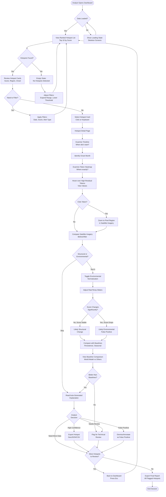
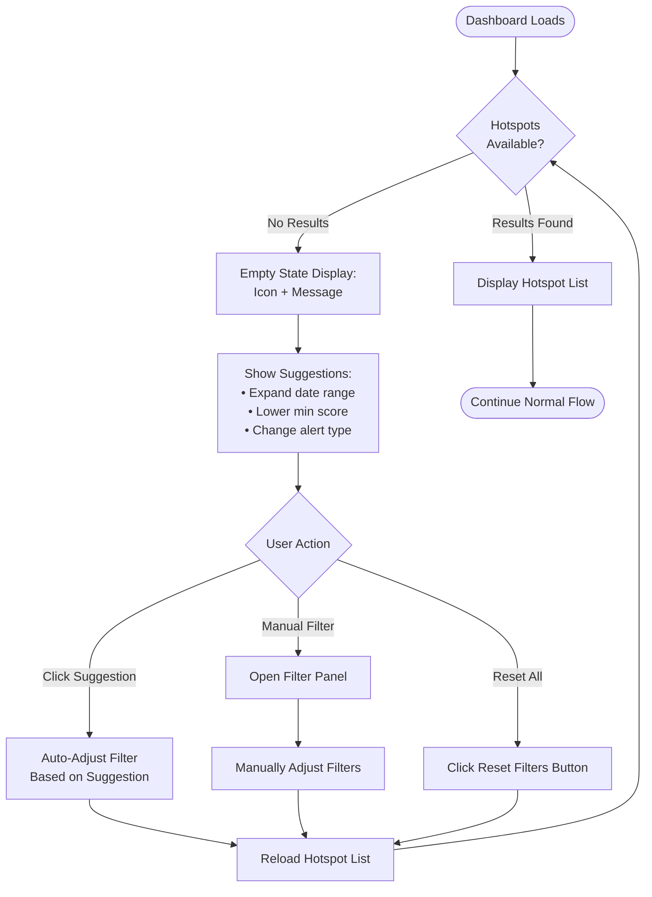
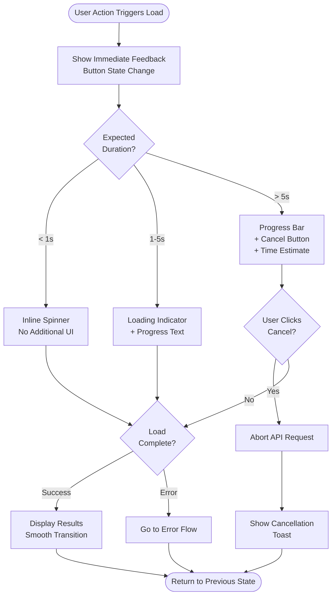
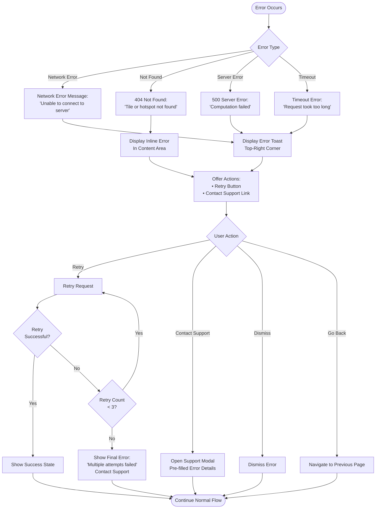
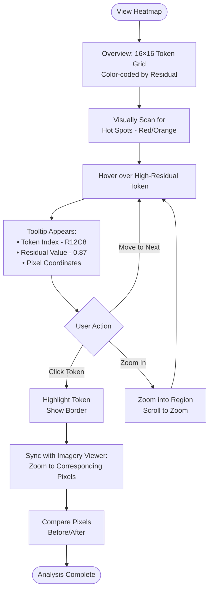
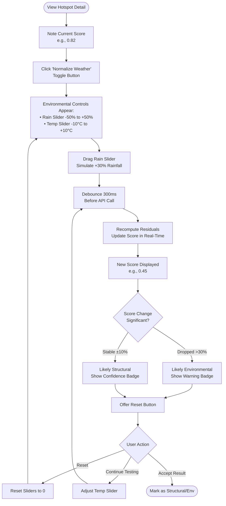
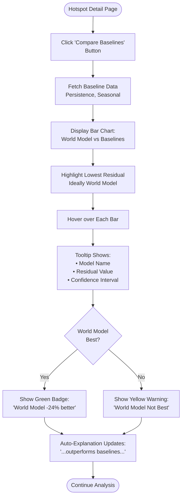

# SIAD User Flow Diagrams

**Version:** 1.0
**Last Updated:** 2026-03-03
**Owner:** Agent 5 (UX/Interaction)

---

## Target User: Alex Chen

**Role:** Geospatial Intelligence Analyst
**Experience:** 5+ years analyzing satellite imagery
**Context:** Works long hours, needs efficient workflow, must explain findings to stakeholders
**Primary Goal:** Quickly identify high-confidence infrastructure changes and distinguish them from weather/seasonal patterns

---

## Primary User Flow

### Complete Analyst Workflow

---

## Alternative Flow 1: Empty State (No Hotspots)

**Trigger:** No hotspots match current filters
**User Goal:** Find hotspots by adjusting parameters

---

## Alternative Flow 2: Loading States

**Trigger:** API calls, computations, data fetching
**User Goal:** Understand progress and maintain control

---

## Alternative Flow 3: Error States

**Trigger:** API failure, network issue, computation error
**User Goal:** Understand problem and recover

---

## Micro-Flows: Key Interactions

### Micro-Flow A: Token Heatmap Exploration

**Duration:** 30-60 seconds
**Goal:** Identify exact pixel location of change

### Micro-Flow B: Environmental Normalization Test

**Duration:** 20-40 seconds
**Goal:** Determine if change is structural or environmental

### Micro-Flow C: Baseline Comparison

**Duration:** 15-30 seconds
**Goal:** Validate world model superiority

---

## Decision Points & User Goals

### Decision Point 1: Filter or Not?
**Location:** Dashboard hotspot list
**User Question:** "Are these the right hotspots for my analysis?"
**Options:**
- Yes → Proceed to select hotspot
- No → Apply filters (date range, score threshold, alert type)

**Design Implications:**
- Make current filters clearly visible
- Provide filter shortcuts (preset ranges: "Last 30 days", "High confidence only")
- Show result count: "Showing 10 of 47 hotspots"

---

### Decision Point 2: Structural or Environmental?
**Location:** Hotspot detail page
**User Question:** "Is this change real infrastructure or just weather?"
**Options:**
- Test with environmental normalization
- Skip testing (trust initial score)
- View historical weather data

**Design Implications:**
- Prominent "Test Environmental Sensitivity" button
- Clear visual feedback when score changes
- Auto-suggest: "Score dropped 40% when rain adjusted → Likely environmental"

---

### Decision Point 3: Export or Flag?
**Location:** After analysis
**User Question:** "What should I do with this hotspot?"
**Options:**
- Export for report (high confidence)
- Flag for technical review (uncertain)
- Dismiss as false positive
- Continue to next hotspot

**Design Implications:**
- Action buttons clearly labeled
- Export options visible: "Export as GeoJSON", "Export Timeline CSV"
- Flag modal: "Add note for reviewer"

---

### Decision Point 4: Click Token or Not?
**Location:** Token heatmap
**User Question:** "Do I need to see the exact pixels?"
**Options:**
- Click to zoom into imagery (precision analysis)
- Just hover for quick check
- Skip heatmap, rely on timeline

**Design Implications:**
- Heatmap optional but prominent
- Tooltip hints: "Click to zoom imagery"
- Keyboard shortcut: `h` to toggle heatmap visibility

---

## User Goals by Page

### Dashboard Page
**Primary Goal:** Quickly identify the most important hotspots
**Secondary Goals:**
- Understand recent trends (new hotspots this week)
- Filter to relevant region/timeframe
- Compare hotspot severity

**Success Metrics:**
- Time to identify top hotspot < 10 seconds
- Can explain why hotspot is ranked #1

---

### Hotspot Detail Page
**Primary Goal:** Determine if hotspot is actionable
**Secondary Goals:**
- Understand when change started (onset)
- Identify exact location (heatmap)
- Rule out environmental false positives
- Compare to baseline models

**Success Metrics:**
- Time to make decision < 2 minutes
- Confidence in decision (self-reported)

---

### Export/Report Flow
**Primary Goal:** Extract data for external reporting
**Secondary Goals:**
- Include metadata (score, onset, confidence)
- Format for GIS tools (GeoJSON)
- Share with stakeholders (CSV)

**Success Metrics:**
- Time to export < 30 seconds
- Export includes all necessary fields

---

## Flow Optimization Opportunities

### Speed Improvements
1. **Keyboard Navigation:** Power users never need mouse
2. **Predictive Loading:** Preload detail page on hover (speculative)
3. **Cached Baselines:** Don't recompute on every visit
4. **Bulk Export:** Select multiple hotspots → Export all

### Clarity Improvements
1. **Progressive Disclosure:** Hide advanced features until needed
2. **Contextual Help:** `?` icon next to complex terms
3. **Visual Timeline:** Color-coded months (onset=red, peak=orange)
4. **Confidence Indicators:** High/Medium/Low badges

### Error Prevention
1. **Confirm Destructive Actions:** "Are you sure you want to dismiss?"
2. **Auto-Save Filters:** Remember user's preferred settings
3. **Warn on Edge Cases:** "Only 2 months of data available"

---

## Accessibility Considerations

### Screen Reader Flow
- Logical heading structure (H1: Dashboard, H2: Hotspot #1)
- ARIA live regions for dynamic updates
- Alt text for heatmap: "Token heatmap showing high residuals in northeast quadrant"

### Keyboard-Only Flow
- All actions accessible via Tab + Enter
- Skip navigation: "Skip to hotspot list"
- Focus trap in modals
- Clear focus indicators (2px border)

### Low Vision Flow
- High contrast mode support
- Zoom up to 200% without breaking layout
- Text alternatives for color-coded data

---

## Next Steps

1. **Review with Agent 3 (Design):** Visual states for each flow node
2. **Review with Agent 4 (Frontend):** Implementation feasibility
3. **Create Interaction Spec:** Detailed timing and feedback (Task 2)
4. **Design Keyboard Shortcuts:** Power user efficiency (Task 3)

---

**Deliverable Status:** COMPLETE ✓
**Dependencies:** Agent 3 (visual design), Agent 4 (implementation)
